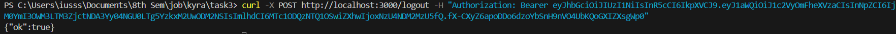

# Session Validation Demo

## Overview

This task demonstrates a simple session validation system using Fastify, JWT and Redis.

Features:
- User login with access and refresh tokens  
- Protected routes requiring authentication  
- Refreshing access tokens using refresh tokens  
- Logout functionality that invalidates sessions  
- Access tokens expire in 15 minutes.  
- Refresh tokens and sessions expire in 7 days.  

---

## API Demo Examples

### 1. Login
User can log in with username and password to receive an access token and refresh token.  
Currently, there is only one hardcoded user for demonstration purposes:

- Username: aayush
- Password: aayush123  

In real applications, usernames and passwords must be stored and retrieved securely from a database.  

### 2. Protected Route
To access a protected route, we need a valid access token in the authorization header.

### 3. Refresh Token
When the access token expires, a refresh token is used to generate a new access token.

### 4. Logout
Logs the user out by deleting the session data.

---

## Setup
1. Install dependencies:
   npm install

2. Setup environment variables in a .env file.

3. Make sure Redis is running.

4. Start the server:
   node server.js

5. Test the API.