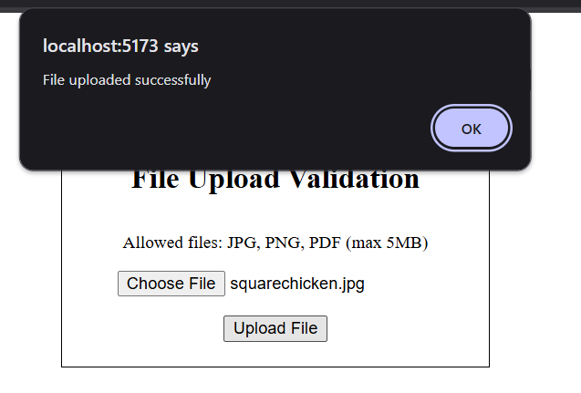

# File Upload Validation Demo

This project demonstrates a file upload system with validation using React and Node.js with Express. Only files with extensions JPG, PNG, and PDF and size <5MB are allowed.

## Demo Images

### 1. File Selection


### 2. Successful Upload


### 3. Invalid File Type


### 4. File too large


### 4. No file chosen


---

## Run Locally

1. **Clone the repository**

```
git clone https://github.com/aayushman950/Kyra-Works-Tasks.git
```

2. Install backend dependencies and start backend server
```
cd task8/backend
npm install
node server.js
```

3. Install frontend dependencies and start frontend server
```
cd task8/frontend
npm install
npm run dev
```

4. Open http://localhost:5173 in the browser and view the demo.